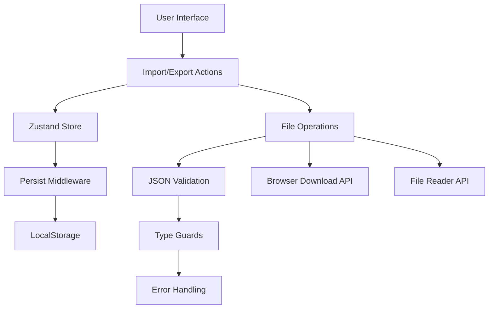

# Design Document

## Overview

The store import/export feature will add data portability to the parquet cutting optimizer by enabling users to save and restore their configurations. The implementation will extend the existing Zustand store with import/export actions and add UI components for file operations. The feature leverages browser APIs for file handling and maintains type safety throughout the data flow.

## Architecture

### High-Level Architecture



### Data Flow

1. **Export Flow**: Store State → JSON Serialization → File Download
2. **Import Flow**: File Selection → JSON Parsing → Validation → Store Update → Persistence

## Components and Interfaces

### Store Extensions

The existing `StripState` interface will be extended with import/export actions:

```typescript
interface StripState {
  // ... existing properties
  exportConfiguration: () => void;
  importConfiguration: (file: File) => Promise<void>;
}
```

### Data Types

```typescript
interface ExportableStoreState {
  roomSize: RoomSize;
  stripWidth: number;
  stripLengths: number[];
  totalLength: number;
  version: string; // For future compatibility
  exportedAt: string; // ISO timestamp
}

interface ImportResult {
  success: boolean;
  error?: string;
  data?: ExportableStoreState;
}
```

### UI Components

#### ImportExportControls Component
- Location: `apps/web/components/import-export-controls.tsx`
- Renders export button and file input for import
- Handles user interactions and feedback
- Integrates with existing UI design system

#### FileValidation Utility
- Location: `apps/web/lib/file-validation.ts`
- Validates JSON structure against expected schema
- Provides type guards for runtime type checking
- Returns detailed error messages for invalid data

## Data Models

### Export Data Structure

```json
{
  "version": "1.0.0",
  "exportedAt": "2025-10-10T14:30:00.000Z",
  "data": {
    "roomSize": {
      "width": 500,
      "height": 300
    },
    "stripWidth": 13,
    "stripLengths": [120, 120, 80, 80],
    "totalLength": 400
  }
}
```

### Validation Schema

The validation will check:
- Required fields presence
- Data types correctness
- Numeric value ranges (positive numbers)
- Array structure for stripLengths
- Version compatibility

## Error Handling

### Error Categories

1. **File Reading Errors**
   - File not selected
   - File read failure
   - Invalid file type

2. **JSON Parsing Errors**
   - Malformed JSON
   - Missing required fields
   - Invalid data types

3. **Validation Errors**
   - Schema mismatch
   - Invalid numeric values
   - Version incompatibility

### Error Display Strategy

- Toast notifications for success/error messages
- Inline error messages for validation failures
- Graceful degradation - preserve current state on import failure
- Detailed error logging for debugging

## Testing Strategy

### Unit Tests
- Store action functionality
- JSON validation logic
- File handling utilities
- Type guard functions

### Integration Tests
- Complete import/export workflow
- Store state persistence after import
- UI component interactions
- Error handling scenarios

### Test Data
- Valid configuration files
- Invalid JSON structures
- Edge cases (empty arrays, zero values)
- Future version compatibility scenarios

## Implementation Considerations

### Browser Compatibility
- Use modern File API with fallback detection
- Leverage Blob API for file generation
- Ensure cross-browser download functionality

### Performance
- Lazy load file validation utilities
- Minimize JSON payload size
- Efficient state updates using Immer

### Security
- Validate all imported data
- Sanitize file inputs
- Prevent XSS through JSON parsing
- File size limitations

### User Experience
- Clear visual feedback during operations
- Descriptive error messages
- Intuitive button placement
- Consistent with existing UI patterns

### Future Extensibility
- Version field for backward compatibility
- Modular validation system
- Plugin architecture for custom formats
- Batch import/export capabilities